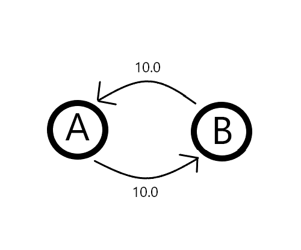

##### [Home](../README.md)
-----

# Patterns

## The Composite pattern
 "The composite pattern describes a group of objects that is treated the same way as a single instance of the same type of object. The intent of a composite is to "compose" objects into tree structures to represent part-whole hierarchies. Implementing the composite pattern lets clients treat individual objects and compositions uniformly."

_from [Wikipedia](https://en.wikipedia.org/wiki/Composite_pattern)_

<center>
 


the composite pattern UML diagram

</center>
 


# Structures

### Graphs
"a graph is a structure amounting to a set of objects in which some pairs of the objects are in some sense related."
###### from [Wikipedia](https://en.wikipedia.org/wiki/Graph_(discrete_mathematics))


In this library graphs are based upon the __composite pattern__ and are of the __directed__ type, meaning the edges (or arches) from node to node are unilateral.
So if you want a connection from node A to node B and vice versa you must use two arches.

#### Example
Nodes are called GraphNodes, and take to generic parameters:
```java
GraphNode<T,A> 
```
- __T__ is the type of the _content_ of the Graph
- __A__ is the type of the _metadata of the Arch_ 


<br>

This is an example code to recreate the rappresented structure.

<center>

</center>

```java
GraphNode<String, Double> nodeA = new GraphNode<>("A");
GraphNode<String, Double> nodeB = new GraphNode<>("B");

nodeA.addGraphNode(nodeB, 10.0);
nodeB.addGraphNode(nodeA, 10.0);
```

<br>

let's now say you want to get a list of every node reachable from _nodeA_
```java
Collection<IGraphNode> nodesReachableFromA = IGraphNode.reachableGraphnodes( nodeA );
```

or, even better for filtering data, you want a `Stream` of all reachable GraphNodes
```java
Stream<IGraphNode> nodeAstream = nodeA.stream();
```

being `Iterable` you can directly use a foreach loop
```java
for ( IGraphNode node : nodeA )
    System.out.println( nodeA.getContent() );
```
