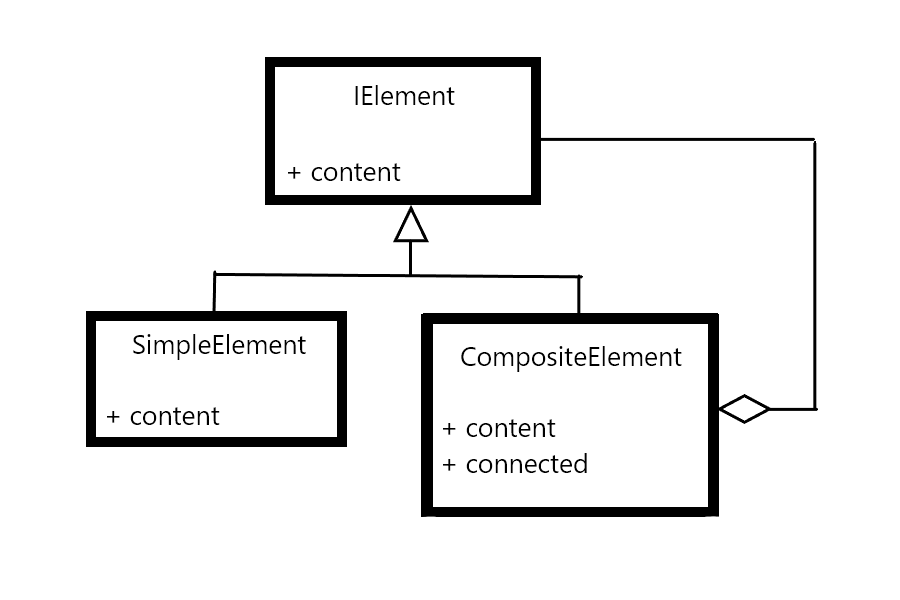

##### [Home](../README.md)
-----

# Patterns

## The Composite pattern
 "The composite pattern describes a group of objects that is treated the same way as a single instance of the same type of object. The intent of a composite is to "compose" objects into tree structures to represent part-whole hierarchies. Implementing the composite pattern lets clients treat individual objects and compositions uniformly."
 ###### from [Wikipedia](https://en.wikipedia.org/wiki/Composite_pattern)

##### the composite pattern UML diagram

 

# Structures

### Graphs

### Trees